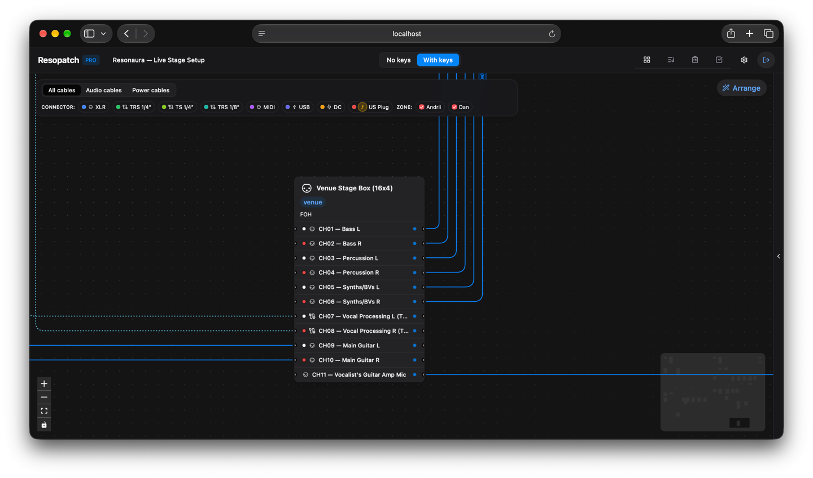

# ResoPatch

Interactive stage routing graph, audio patchbay coordinator, and automated technical rider generator for live concert rigs.

[](#)
[](#)
[](#)
[](#)
[-654FF0.svg?style=flat-square&logo=webassembly&logoColor=white)](#)
[](#)
[](#)
[](#)
[](https://buymeacoffee.com/resonaura)

<p align="center">
  
</p>

ResoPatch translates messy stage cabling, pedalboards, audio interfaces, and power distribution setups into a validated visual node graph. It calculates orthogonal cable runs in WebAssembly, validates signal compatibility across audio and electrical boundaries, and compiles the entire live setup into an exportable venue technical rider.

---

## Architectural Overview

ResoPatch is structured as a pnpm monorepo separating domain rules, graph presentation, and real-time backend state.

```
resopatch/
├── apps/
│   ├── web/        # React 19 SPA, XYFlow canvas, WASM edge routing, HeroUI
│   └── api/        # NestJS 11 + Fastify, SQLite persistence, Socket.IO, Puppeteer export
└── packages/
    └── shared/     # Domain schemas, connector specs, validation rules, DTOs
```

### 1. WebAssembly Obstacle Avoidance & Edge Routing
Standard graph visualization libraries draw bezier splines directly across intermediate nodes, creating visual noise when mapping 30+ physical stage connections.

ResoPatch integrates `libavoid` compiled to WebAssembly via a dedicated Web Worker:
- **Spatial Obstacle Representation**: Physical device nodes register their bounding boxes and port offsets with the router.
- **Orthogonal Channelization**: Cable paths calculate right-angle trajectories that wrap around gear footprints with user-configurable gutter margins.
- **Worker Isolation**: Route recalculations execute off the browser main thread to maintain 60 FPS viewport panning and zooming during live layout edits.

### 2. Physical Port & Signal Topology Validation
Connections in ResoPatch enforce real-world audio engineering constraints before committing to state:
- **Audio Boundaries**: Distinguishes balanced line level (+4 dBu / -10 dBV), microphone level, high-impedance instrument feeds, and digital streams (ADAT, S/PDIF).
- **Connector Compatibility**: Enforces matching physical interfaces across XLR, 1/4" TRS, 1/4" TS, RCA, Speakon, and 3.5mm stereo jacks.
- **Power Distribution Tracing**: Tracks AC mains feeds (Schuko, IEC C13, PowerCON) through power conditioners down to DC pedal power bricks (isolated 9V/12V/18V center-negative rails).
- **Polarity & Grounding**: Flags ground-lift requirements and polarity mismatches across splitters and passive DI units.

### 3. Automated Technical Rider & Stage Box Compilation
Live venues require structured paperwork rather than node diagrams. The API inspects graph topology and compiles real-time documentation:

<p align="center">
  
</p>

- **Stage Input List**: Derives sequential FOH channel assignments from stage box patch bays, including source instrument, pickup type, line level, connector standard, and phantom power (+48V) requirements.
- **Packing & Hardware Checklist**: Cross-references user-owned inventory against venue backline needs, splitting gear requirements into dual checkable packing lists.
- **Headless Document Rendering**: Puppeteer launches an isolated browser session to capture pixel-accurate print stylesheets into vectorized landscape A4 PDF documents.

### 4. Real-Time Stage Collaboration
During concert soundchecks, musicians on stage and front-of-house engineers at the mixing desk access synchronized state over Socket.IO:
- Layout edits, port re-patches, and mute states propagate over WebSockets in sub-50ms intervals.
- The NestJS event gateway uses room-based subscriptions and transactional SQLite updates via `better-sqlite3`.

---

## Technology Stack

| Layer | Technology | Purpose |
| :--- | :--- | :--- |
| **Canvas & UI** | React 19, `@xyflow/react`, HeroUI v3 | Node graph rendering and parameter inspector panels |
| **Path Router** | `libavoid-js` (WASM), Web Workers | Orthogonal cable routing around gear obstacles |
| **Styling** | Tailwind CSS v4, CSS Variables | Hardware rack aesthetic with dark-mode canvas styling |
| **Backend API** | NestJS 11, Fastify, TypeORM | REST endpoints, WebSocket gateway, and asset pipeline |
| **Database** | SQLite (`better-sqlite3`) | Fast embedded relational storage with zero-latency queries |
| **Asset Engine** | Sharp, Puppeteer | Multi-size WebP device photo processing and PDF rendering |
| **Validation** | Zod, TypeScript 5.9 | Shared runtime schemas and domain invariants |

---

## Local Development Setup

### Prerequisites
- Node.js >= 20.x
- pnpm >= 10.x
- Python 3 with build tools (for native SQLite bindings)

### Installation
```bash
# Clone the repository
git clone https://github.com/resonaura/resopatch.git
cd resopatch

# Install dependencies
pnpm install

# Build shared domain package
pnpm --filter @resopatch/shared build

# Seed database with sample stage setup
pnpm --filter @resopatch/api seed
```

### Running the Services
```bash
# Start both API and Web frontend concurrently
pnpm dev
```

The web interface will be available at `http://localhost:5173` (Default passphrase: `admin`).  
The REST and WebSocket API runs on `http://localhost:3001`.

---

## License

This project is licensed under the [MIT License](LICENSE).
